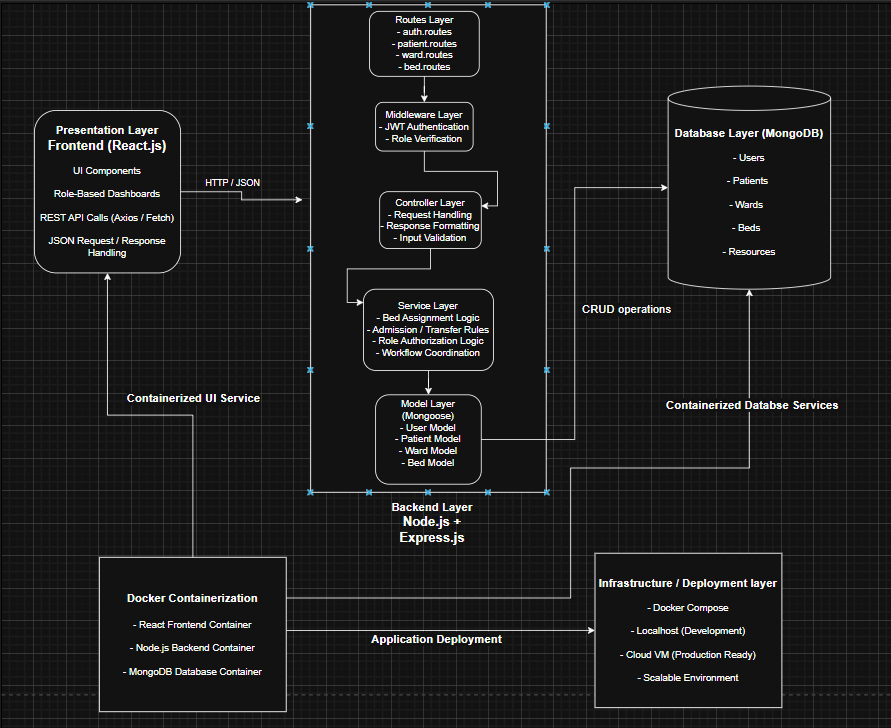
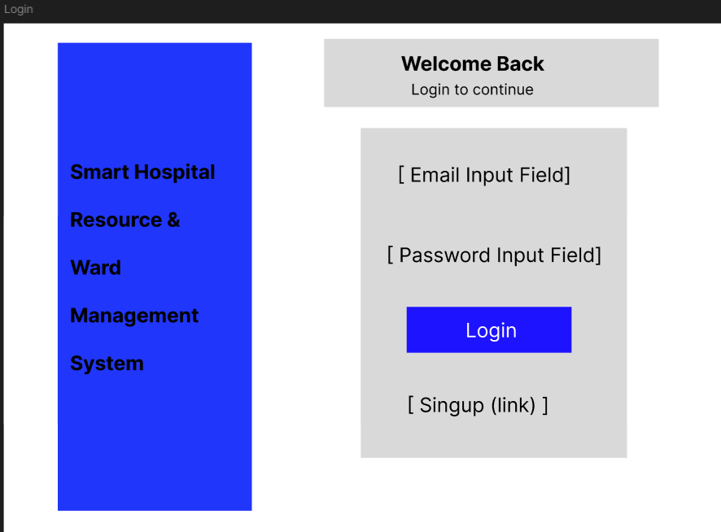
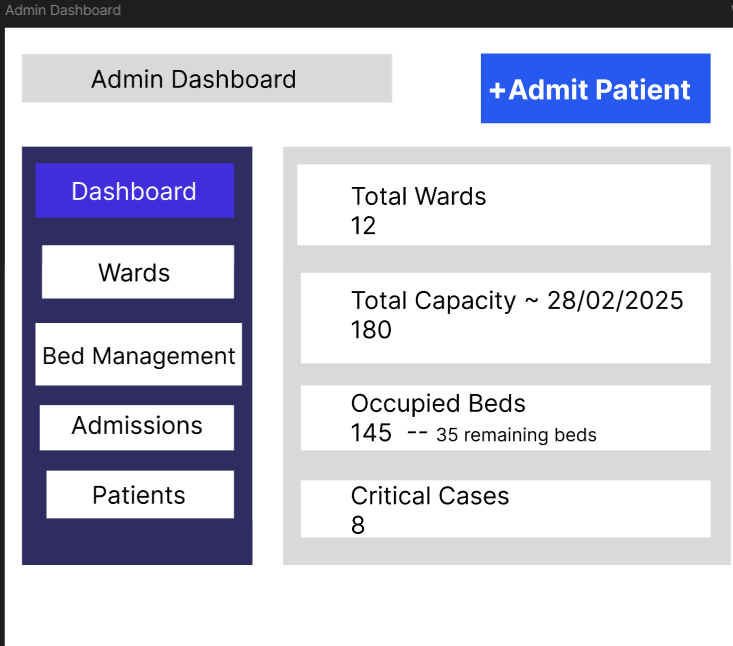
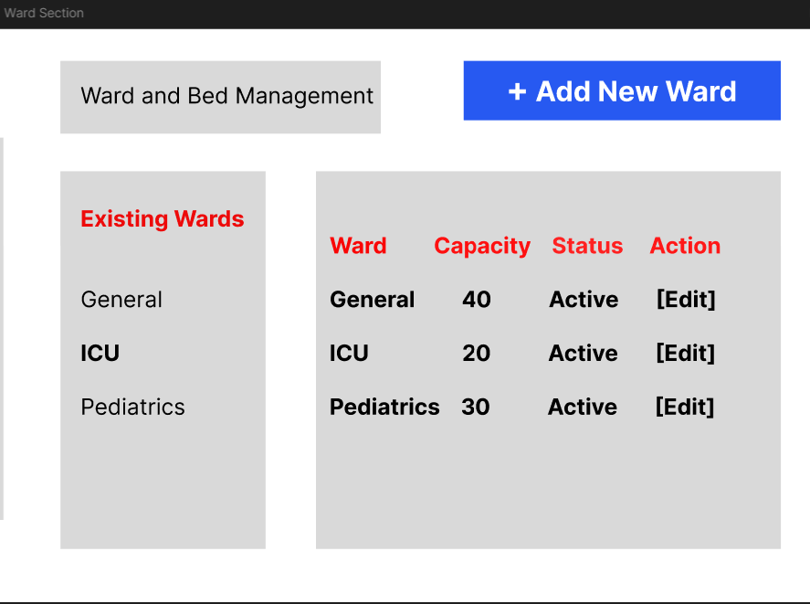
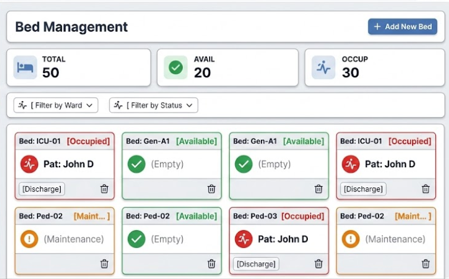
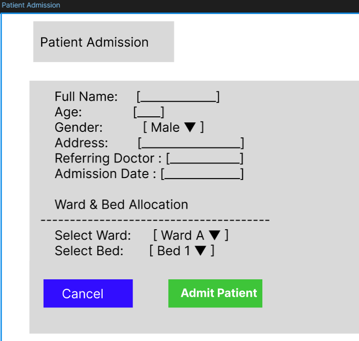
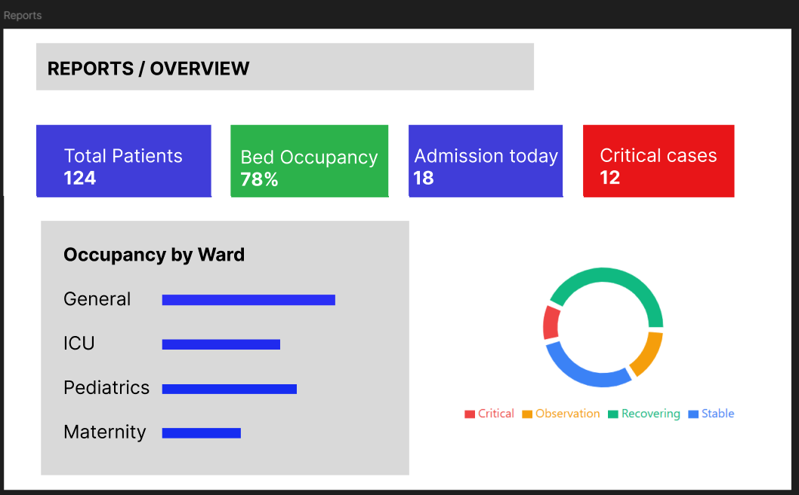

# Hospital Resource & Ward Management System

## 1. Project Overview

The Hospital Resource & Ward Management System is a web-based application designed to assist hospitals in efficiently managing inpatient resources such as wards, beds, rooms, medical equipment, and staff. The system provides real-time visibility into hospital resource utilization, streamlines patient admission, transfer, and discharge workflows, and supports informed decision-making for hospital administrators.

Many small and medium-sized hospitals continue to rely on manual registers or fragmented digital systems. These approaches often result in inefficiencies such as overcrowding, delayed admissions, inaccurate availability tracking, and poor resource utilization. This project aims to replace such manual processes with a centralized, reliable, and user-friendly digital platform.

---

## 2. Problem Statement

Hospitals face several operational challenges in managing inpatient resources, including:

- Manual or disconnected tracking of ward and bed availability
- Difficulty in managing patient admissions, transfers, and discharges
- Lack of real-time visibility into ward occupancy
- Underutilization or overloading of hospital resources
- Increased administrative workload and human errors

Existing hospital management solutions are often expensive, complex, or not tailored to the needs of small and medium hospitals. There is a need for a simple, affordable, and customizable system focused specifically on ward and resource management.

---

## 3. Target Users (Personas)

### 3.1 Hospital Administrator

- Oversees overall hospital operations
- Monitors ward occupancy and resource utilization
- Requires administrative dashboards, reports, and control features

### 3.2 Doctor

- Admits, transfers, and discharges patients
- Needs quick access to bed availability and patient records
- Requires role-based system access without administrative complexity

### 3.3 Nursing and Support Staff

- Manages ward-level operations
- Updates patient status and bed allocation
- Requires a simple, intuitive, and mobile-friendly interface

---

## 4. Vision Statement

To develop an intuitive and reliable digital system that simplifies hospital ward and resource management, ensures optimal utilization of inpatient facilities, and improves operational efficiency while maintaining data accuracy and security.

---

## 5. Key Features and Goals

- Role-based user authentication and secure system access
- Digital management of wards, rooms, and beds
- Structured workflows for patient admission, transfer, and discharge
- Real-time tracking of bed and ward availability
- Equipment and medical resource inventory management
- Staff assignment to wards and duty shifts
- Administrative dashboard with occupancy statistics and reports
- Search and filter functionality for patients and resources
- Scalable and mobile-friendly web-based interface

---

## 6. Technology Stack

This project is developed using the MERN stack along with containerization for consistent development and deployment.

- **Frontend:** React.js
  - Component-based user interface
  - Role-based dashboards for Admin, Doctor, and Staff

- **Backend:** Node.js with Express.js
  - RESTful APIs
  - Business logic for admissions, transfers, and discharges
  - Role-based access control

- **Database:** MongoDB
  - Centralized storage for patients, wards, beds, users, and resources

- **Containerization:** Docker & Docker Compose
  - Separate containers for frontend, backend, and database
  - Ensures consistent local development and deployment

- **Design & Documentation Tools:**
  - Figma (Wireframes)
  - Draw.io (Architecture Diagram)
  - Git & GitHub (Version Control)

---

## 7. Success Metrics

- The system correctly supports all admission, transfer, and discharge workflows
- At least 80% of users can perform core tasks without external assistance
- Real-time availability data accurately reflects ward and bed status
- Role-based access prevents unauthorized data access
- Stable and reliable performance during a continuous 30-day testing period
- Project completion within the defined scope and timeline

---

## 8. Assumptions

- Users have access to desktop or mobile devices with web browsers
- Hospital staff are willing to transition from manual processes to a digital system
- Reliable internet connectivity is available within the hospital
- The development team has access to required open-source development tools

---

## 9. Constraints

- The project must be completed within a three-month development timeline
- Only free and open-source technologies will be used
- The development team consists of students with basic to intermediate technical skills
- The user interface must remain simple and easy to use for non-technical users
- Patient and operational data must be securely stored and accessed

---

## 10. MoSCoW Prioritization

| Feature                     | Priority    | Related User Stories                               |
| --------------------------- | ----------- | -------------------------------------------------- |
| User Authentication & Login | Must Have   | Admin Login, Doctor Login, Staff Login             |
| Ward & Bed Management       | Must Have   | Manage Wards, Manage Beds, Update Bed Status       |
| Patient Admission Workflow  | Must Have   | Admit Patient, Transfer Patient, Discharge Patient |
| Occupancy Dashboard         | Should Have | View Occupancy Dashboard                           |
| Equipment Inventory         | Should Have | Manage Equipment                                   |
| Reports & Analytics         | Could Have  | Generate Reports, View Analytics                   |
| Billing Integration         | Won’t Have  | Billing Integration                                |

---

## 11. Architecture Overview

The system follows a layered MERN-based architecture:

- The **React frontend** handles user interaction and displays role-based dashboards.
- The **Node.js + Express backend** processes business logic and exposes REST APIs.
- **MongoDB** stores all hospital-related data in a centralized database.
- **Docker** is used to containerize frontend, backend, and database services.
- The application is deployed using **Docker Compose** for simplified setup and scalability.

This architecture ensures modularity, scalability, and ease of deployment.

## 12. Branching Strategy (GitHub Flow)

- This project follows the GitHub Flow branching strategy to manage source code efficiently and ensure stability throughout the development process.

- The main branch contains stable and production-ready code. All new features and changes are developed in separate feature branches to avoid affecting the stability of the main branch.

- Branching Workflow

- The development starts from the main branch.

- A new feature branch is created for implementing specific functionality.

- Development and testing are performed within the feature branch.

- After verification, the feature branch is merged back into the main branch.

- The updated main branch represents the latest stable version of the project.

- Feature Branch Used in This Project

- For this project, a feature branch named:

**feature/frontend-ui**

was created to develop the frontend user interface, including:

- Login and authentication screens

- Admin dashboard

- Ward and bed management pages

- Patient admission workflow

- The changes were tested locally and then merged into the main branch to maintain a clean and stable codebase.

- Benefits of Using GitHub Flow

- Enables isolated feature development

- Prevents unstable code from entering the main branch

- Improves code organization and version control

- Supports easier collaboration and maintenance

- This branching strategy ensures better project management and aligns with industry-standard development practices.

---

## 13. Software Design

### 13.1 High-Level Architecture

The system follows a **Layered Client–Server Architecture with an MVC-inspired backend structure**.

- Presentation Layer – React frontend
- Routing Layer – Express routes
- Business Logic Layer – Controllers & Services
- Middleware Layer – Authentication & Role Verification
- Data Access Layer – Mongoose Models
- Database Layer – MongoDB
- Infrastructure Layer – Docker & Docker Compose

This architecture ensures clear separation of concerns, low coupling, and high modularity.

#### Architecture Diagram

Editable Draw.io file available in:

`docs/design/architecture.drawio`

---

### 13.2 Design Principles Applied

The system was designed using core software engineering principles:

- **Abstraction:** Frontend interacts with backend only through REST APIs.
- **Modularity:** Backend structured into routes, controllers, services, middleware, and models.
- **High Cohesion:** Each module performs a single well-defined responsibility.
- **Low Coupling:** Components communicate via well-defined interfaces.
- **Separation of Concerns:** UI, business logic, and data access are clearly separated.

These principles improve maintainability, scalability, and readability of the system.

---

### 13.3 User Interface Design

Figma was used to design low-fidelity wireframes before implementation.  
The UI focuses on clarity, structured workflow, and consistency.

#### Designed Screens

- Login Screen
- Admin Dashboard
- Ward Management
- Bed Management
- Patient Admission
- Reports / Occupancy Overview

#### Figma Screenshots

---

### 13.4 Key Design Decisions

- Adopted layered Client–Server architecture for scalability and maintainability.
- Implemented modular backend structure (routes, controllers, services, models).
- Centralized bed allocation logic to maintain data consistency.
- Used RESTful APIs for loose coupling between frontend and backend.
- Applied Docker containerization for environment consistency and portability.
- Implemented JWT-based authentication with role-based access control.

## 14. How to Run the Project

### Using Docker

docker-compose up --build

Frontend: http://localhost:3000  
Backend: http://localhost:5000

### Without Docker

1. cd backend
2. npm install
3. npm run dev

4. cd frontend
5. npm install
6. npm start
